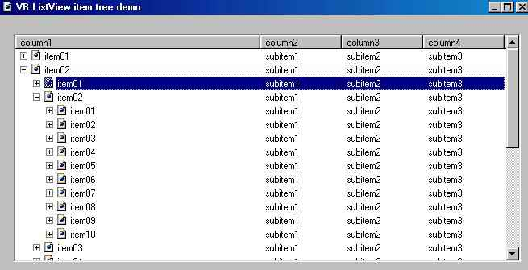



## ListView with treeview like Kazaa

### Description

That code was created by Brad Martinez from http://www.mvps.org (Copyright © 1997-1999) i just compiled it to VB6 Sp4 and made a little adjustment. This code use a listview to simulate a control with a treeview and listview like this one we see on Kazaa or Morpheus. Enjoy.
 
### More Info
 

             |
---                |---
**Submitted On**   |2002-01-23 09:36:00
**By**             |[Schwartz](https://github.com/Planet-Source-Code/PSCIndex/blob/master/ByAuthor/schwartz.md)
**Level**          |Intermediate
**User Rating**    |4.8 (111 globes from 23 users)
**Compatibility**  |VB 6\.0
**Category**       |[Custom Controls/ Forms/  Menus](https://github.com/Planet-Source-Code/PSCIndex/blob/master/ByCategory/custom-controls-forms-menus__1-4.md)
**World**          |[Visual Basic](https://github.com/Planet-Source-Code/PSCIndex/blob/master/ByWorld/visual-basic.md)
**Archive File**   |[ListView\_w505081232002\.zip](https://github.com/Planet-Source-Code/schwartz-listview-with-treeview-like-kazaa__1-31092/archive/master.zip)

### API Declarations

some

